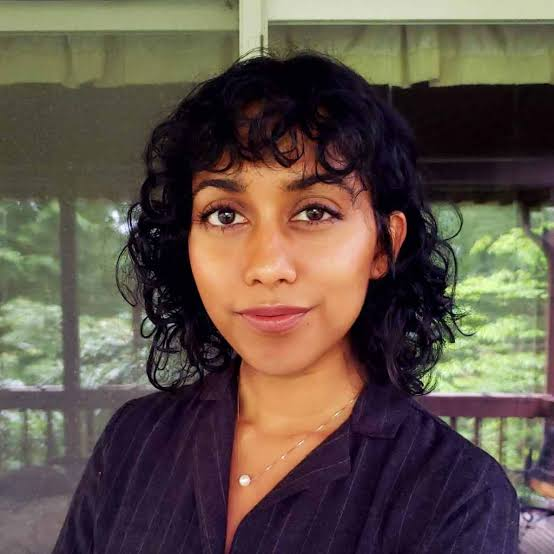
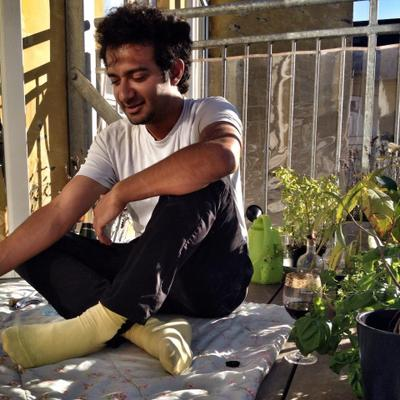
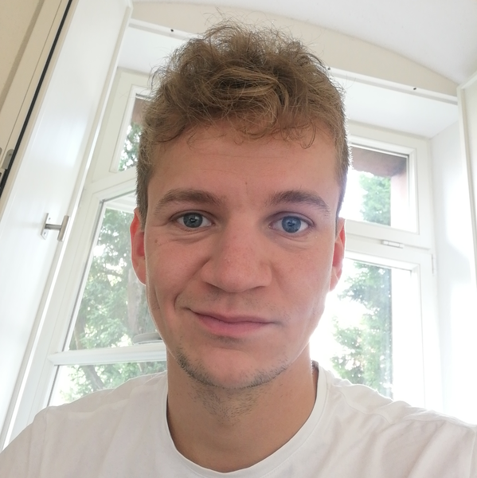

# Lead Organizers

  

    
    

      <strong>Avijit Ghosh</strong>
      Applied Policy Researcher, Hugging Face
      <a href="mailto:avijit@huggingface.co">avijit@huggingface.co</a>
    

  

  

    
    

      <strong>Irene Solaiman</strong>
      Head of Global Policy, Hugging Face
      <a href="mailto:irene@huggingface.co">irene@huggingface.co</a>
    

  

  

    
    

      <strong>Zeerak Talat</strong>
      Research Fellow, MBZUAI
      <a href="mailto:z@zeerak.org">z@zeerak.org</a>
    

  

  

    
    

      <strong>Yacine Jernite</strong>
      Machine Learning and Society Lead, Hugging Face
      <a href="mailto:yacine@huggingface.co">yacine@huggingface.co</a>
    

  

# Core Organizers

  

    
    

      <strong>Usman Gohar</strong>
      Ph.D. student, Iowa State University
      <a href="mailto:ugohar@iastate.edu">ugohar@iastate.edu</a>
    

  
  
  

    
    

      <strong>Jennifer Mickel</strong>
      Researcher in AI and algorithmic fairness
      <a href="mailto:jamickel@utexas.edu">jamickel@utexas.edu</a>
    

  

  

    
    

      <strong>Lucie-Aimée Kaffee</strong>
      Applied Policy Researcher, Hugging Face
      <a href="mailto:lucie.kaffee@huggingface.co">lucie.kaffee@huggingface.co</a>
    

  

  

    
    

      <strong>Arjun Subramonian</strong>
      Computer Science PhD candidate, UCLA
      <a href="mailto:arjunsub@cs.ucla.edu">arjunsub@cs.ucla.edu</a>
    

  

  

    
    

      <strong>Alberto Lusoli</strong>
      Digital Democracies Institute Deputy Director, Simon Fraser University
      <a href="mailto:alberto.lusoli@gmail.com">alberto.lusoli@gmail.com</a>
    

  

  

    
    

      <strong>Felix Friedrich</strong>
      PhD student, TU Darmstadt & hessian.AI
      <a href="mailto:friedrich@cs.tu-darmstadt.de">friedrich@cs.tu-darmstadt.de</a>
    

  

# Additional Contributors

- William Agnew (University of Washington)
- Lama Ahmad (OpenAI)
- Dylan Baker (DAIR)
- Canyu Chen (Illinois Institute of Technology)
- Hal Daumé III (University of Maryland)
- Jesse Dodge (Allen Institute for AI)
- Isabella Duan (University of Chicago)
- Ellie Evans (Independent)
- Sara Hooker (Cohere for AI)
- Ria Kalluri (Stanford University)
- Alina Leidinger (University of Amsterdam)
- Michelle Lin (Mila Quebec AI Institute)
- Xiuzhu Lin (Independent)
- Sasha Luccioni (Hugging Face)
- Margaret Mitchell (Hugging Face)
- Jessica Newman (UC Berkeley)
- Anaelia Ovalle (University of California, Los Angeles)
- Marie-Therese Png (Oxford University)
- Levent Sagun (Independent)
- Shubham Singh (University of Illinois Chicago)
- Andrew Strait (Ada Lovelace)
- Lukas Struppek (German Center for Artificial Intelligence, TU Darmstadt)

# Acknowledgments

We gratefully acknowledge the support of all our organizers, additional contributors, and the NeurIPS community in making this workshop possible.

