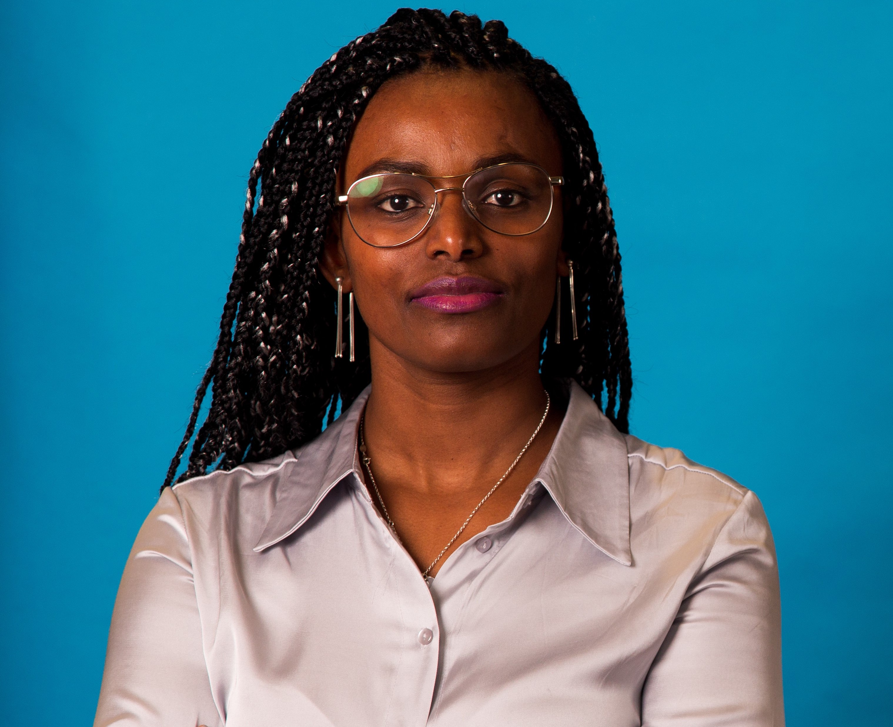
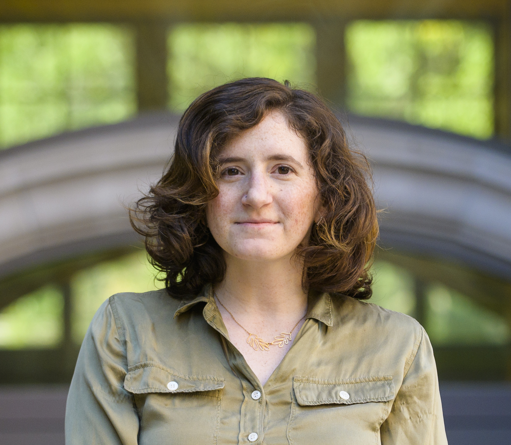
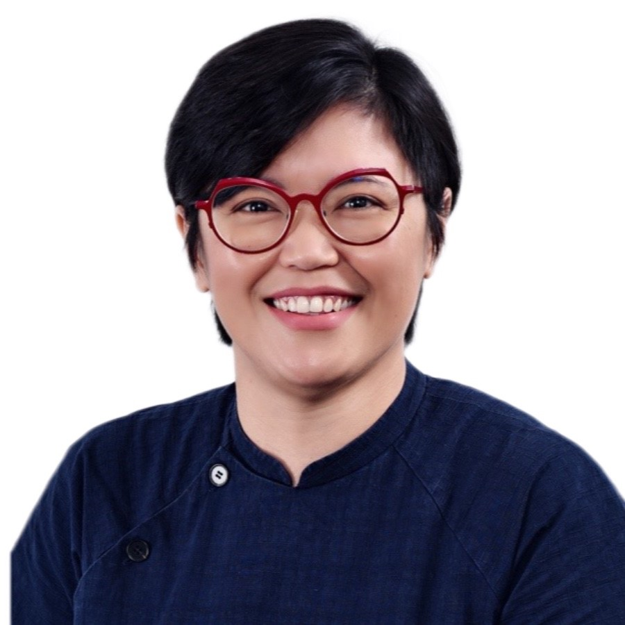

We are excited to bring together a stellar group of experts to discuss the critical topic of evaluating the broader impacts of generative AI systems. Here are our panel of speakers:

<!--   

    
    

      
Abeba Birhane

      

        Abeba Birhane is an Ethiopian-born cognitive scientist working at the intersection of complex adaptive systems, machine learning, algorithmic bias, and critical race studies. Her groundbreaking work has uncovered racist and misogynistic labels in large-scale image datasets commonly used in AI systems. Recognized as a top innovator in computer vision by VentureBeat and named one of the 100 most influential persons in AI 2023 by TIME magazine, Birhane's research continues to shape critical discussions in AI ethics and fairness.
      

    

  

 -->
  

    
    

      
Abigail Jacobs

      

        Abigail Jacobs is an Assistant Professor of Information at the University of Michigan School of Information and an Assistant Professor of Complex Systems in the College of Literature, Science, and the Arts. As a 2024 Microsoft Research AI & Society Fellow, her research focuses on measurement and hidden assumptions in machine learning, structure, governance, and inequality in sociotechnical systems, and social networks. With a PhD in Computer Science from the University of Colorado Boulder, Jacobs brings a wealth of experience from her postdoctoral work at UC Berkeley and her involvement with Women in Machine Learning.
      

    

  

 

    
    

      
Lee Wan Sie

      

        Lee Wan Sie is the Director for Data-Driven Tech at Singapore's Infocomm Media Development Authority. She leads AI governance efforts, fosters a trustworthy AI ecosystem, and collaborates globally on safe, responsible AI. Her role includes developing AI regulatory policies and promoting emergent data technologies like privacy-enhancing tech. With extensive public sector experience, she previously shaped Singapore’s Digital Economy and Smart Nation strategies, led tech innovation at IDA Labs, and implemented government digital services. Internationally, she has supported national digitalization efforts and actively champions Women in Tech in Singapore.
      

    

  

  

  

    
    

      
Su Lin Blodgett

      

        Su Lin Blodgett is a senior researcher in the Fairness, Accountability, Transparency, and Ethics in AI (FATE) group at Microsoft Research Montréal. Her work focuses on examining the social and ethical implications of natural language processing technologies, developing approaches for anticipating, measuring, and mitigating harms arising from language technologies. With a Ph.D. in computer science from the University of Massachusetts Amherst and experience as an NSF Graduate Research Fellow, Blodgett brings a unique perspective to the critical discussions surrounding the evaluation and impact of generative AI systems.
      

    

  

  

